#一、OC对象的本质
###1、OC对象的本质
1、我们平时编写的Objective-C代码，底层实现其实都是C\C++代码

2、所以Objective-C的面向对象都是基于C\C++的$\color{red}{结构体}$实现的
3、将Objective-C代码转换为C\C++代码
```
xcrun  -sdk  iphoneos  clang  -arch  arm64  -rewrite-objc  OC源文件  -o  输出的CPP文件
如果需要链接其他框架，使用-framework参数。比如-framework UIKit
```
###2、一个OC对象在内存中是如何布局的

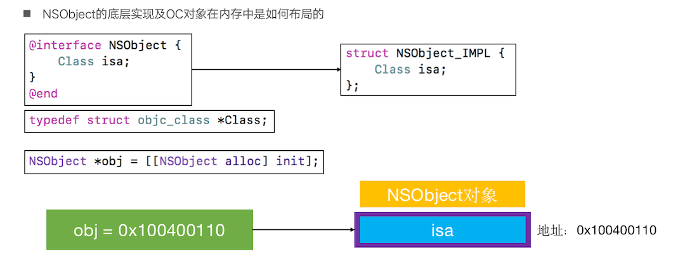

###3、一个NSObject对象占用多少内存？
```
1、系统分配了16个字节给NSObject对象（通过malloc_size函数获得）
2、但NSObject对象内部只使用了8个字节的空间（64bit环境下，可以通过class_getInstanceSize函数获得）
```

###4、两个容易混淆的概念
```
1、创建一个实例对象，至少需要多少内存？
    #import <objc/runtime.h>
    class_getInstanceSize([NSObject class]);
2、创建一个实例对象，实际上分配了多少内存？
    #import <malloc/malloc.h>
    malloc_size((__bridge const void *)obj);
```

#二、Object-C对象的分类
###1、instance对象（实例对象）
&nbsp;&nbsp;&nbsp;&nbsp;&nbsp;&nbsp;&nbsp;实例对象就是通过类alloc出来的对象，每次调用alloc都会产生新的实例对象。

instance对象在内存中存储的信息包括
```
    1、isa指针
    2、其他成员变量
    ......
````
<center>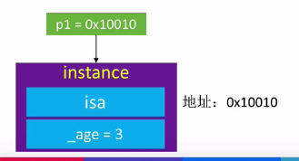</center>

###2、class对象（类对象）

* 实例对象决定成员变量的值，类对象决定成员变量(类型，名称)
* 一个类的类对象，在内存中有且只有一个class对象
* class对象在内存中存储的信息主要包括
```
    1、isa指针
    2、superClass指针
    3、属性信息(@property)、对象方法信息(instance method)
    4、协议信息(protocol)、成员变量信息(ivar)
    ......
```
<center>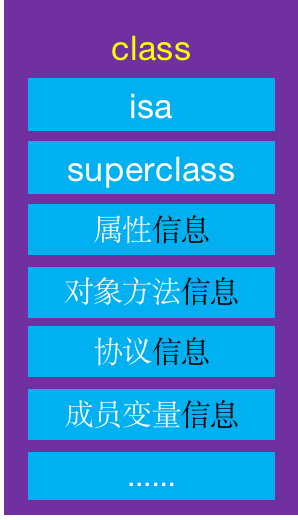</center>


###3、meta-class对象（元类对象） 

* objectMetaClass是NSObject的meta-class对象（元类对象）
* 每个类在内存中有且只有一个meta-class对象
* meta-class对象和class对象的内存结构是一样的，但是用途不一样，在内存中存储的信息主要包括
```
    isa指针
    superclass指针
    类的类方法信息（class method）
    ......
```
<center>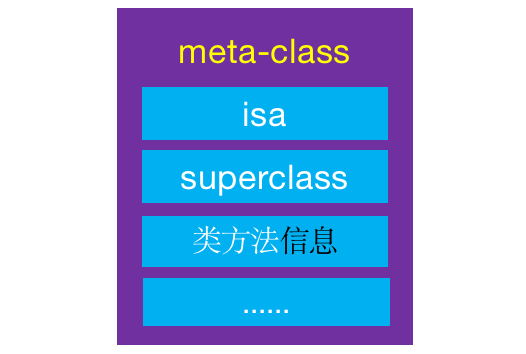</center>


#三、isa指针与superclass指针
###1、isa指针 
```
1、对象的isa指针指向哪里？
    instance对象的isa指向class对象
    class对象的isa指向meta-class对象
    meta-class对象的isa指向基类的meta-class对象
2、OC的类信息存放在哪里？
    对象方法、属性、成员变量、协议信息，存放在class对象中
    类方法，存放在meta-class对象中
    成员变量的具体值，存放在instance对象
```
<center>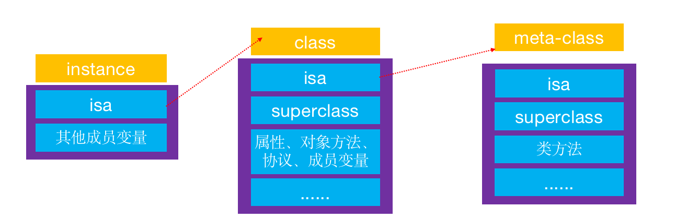</center>


###2、Class的superclass指针
```
当Student的instance对象要调用Person的对象方法时，会先通过isa找到Student的class，
然后通过superclass找到Person的class，最后找到对象方法的实现进行调用
```
<center>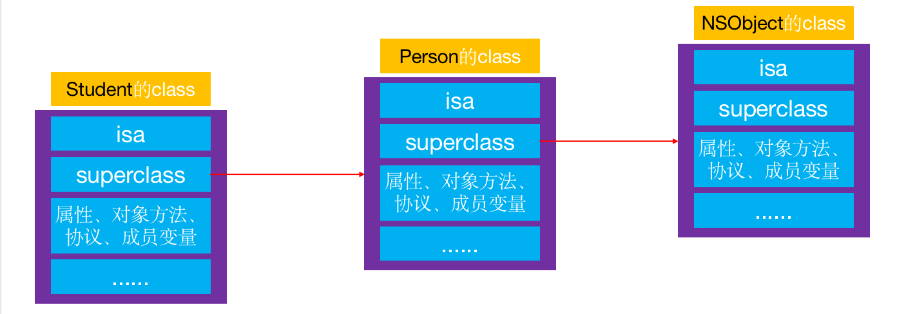</center>

###3、meta-class对象的superclass指针
```
当Student的class要调用Person的类方法时，会先通过isa找到Student的meta-class，
然后通过superclass找到Person的meta-class，最后找到类方法的实现进行调用
```
<center>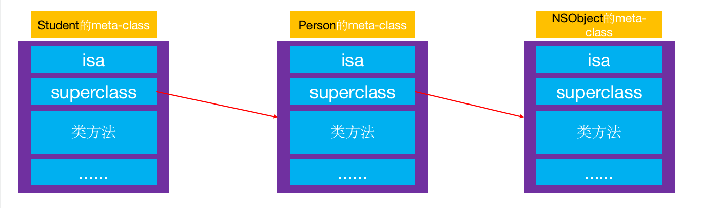</center>

###4、isa、superclass总结
```
1、instance的isa指向class
2、class的isa指向meta-class
3、meta-class的isa指向基类的meta-class
4、class的superclass指向父类的class
    如果没有父类，superclass指针为nil
5、meta-class的superclass指向父类的meta-class
    基类的meta-class的superclass指向基类的class
6、instance调用对象方法的轨迹
    isa找到class，方法不存在，就通过superclass找父类
7、class调用类方法的轨迹
    isa找meta-class，方法不存在，就通过superclass找父类
```
<center>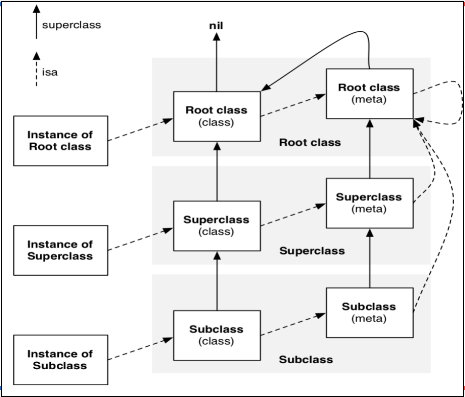</center>


#四、窥探struct objc_class的结构

###1、class、meta-class对象的本质结构都是struct objc_class
<center>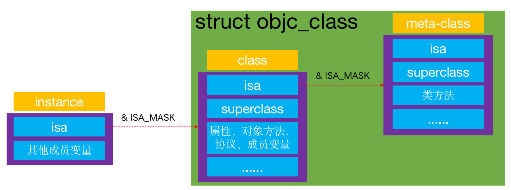</center>
###2、bjc_class的结构
<center>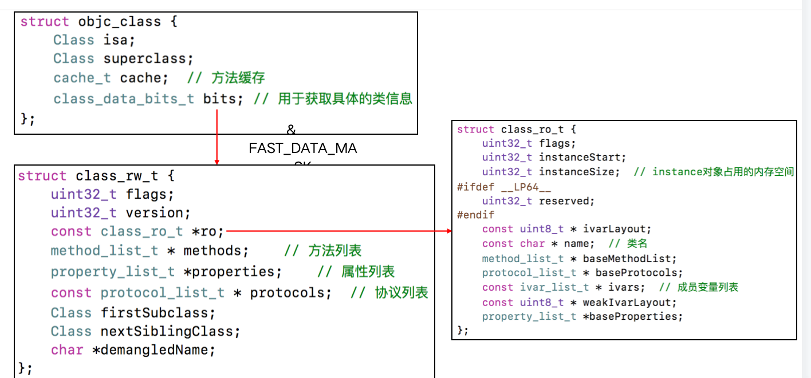</center>
###3、class_rw_t
<center>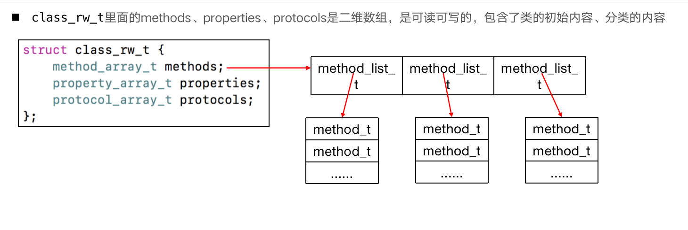</center>
###4、class_ro_t
<center>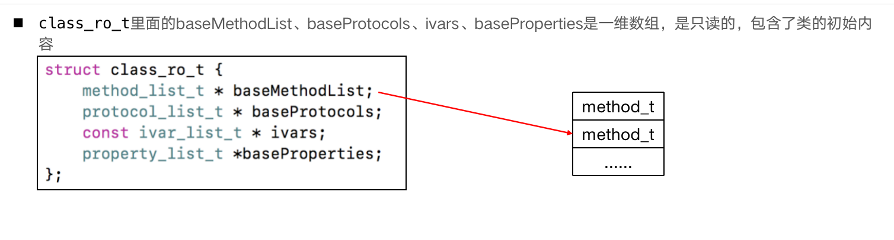</center>
###5、method_t
<center>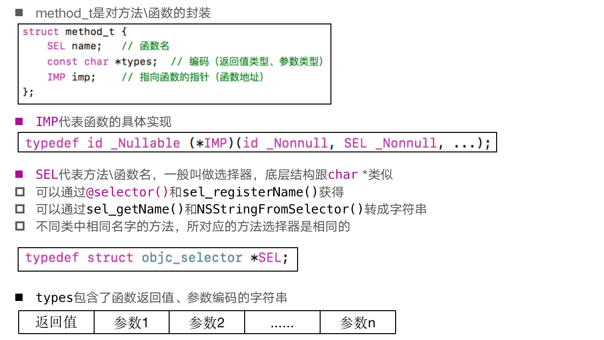</center>
###6、Type Encoding
<center></center>
###7、方法缓存
<center>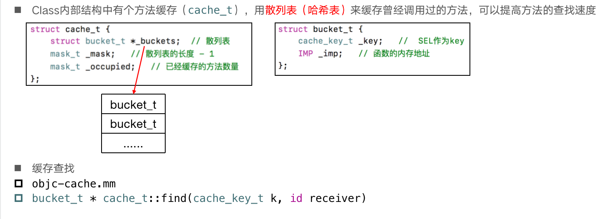</center>
查找顺序：
```
    * 如果是有序方法列表，采用二分查找
    * 如果是无序方法列表，直接遍历查找
```


