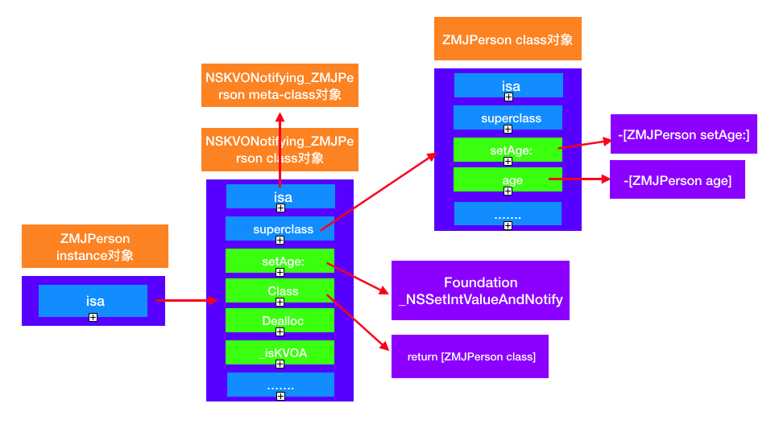

#KVO
###一、KVO的介绍
####1、什么是KVO

&nbsp; &nbsp; &nbsp;KVO的全称是Key-Value Observing，俗称“键值监听”，可用于监听某个对象属性值的改变；是对观察者模式的一种实现，apple使用了isa-swizzling来实现KVO

####2、KVO的使用注意

 &nbsp; &nbsp; &nbsp;KVO的addObserver和removeObserver需要是成对的，如果重复remove则会导致NSRangeException类型的Crash，如果忘记remove则会在观察者释放后再次接收到KVO回调时Crash。

 &nbsp; &nbsp; &nbsp;苹果官方推荐的方式是，在init的时候进行addObserver，在dealloc时removeObserver，这样可以保证add和remove是成对出现的，是一种比较理想的使用方式。


###二、KVO监听对象的本质



* 利用Runtime动态生成一个子类，并且让instance对象的isa指向这个全新的子类
* 修改instance对象的属性时，会调用Foundation的_NSSetXXXValueAndNotify函数
1、willChangeValueForKey:
2、父类原来的setter
3、didChangeValueForKey:
4、内部会触发监听器（Oberser）的监听方法( observeValueForKeyPath:ofObject:change:context:）


###三、KVO内部调用顺序
KVO内部调用顺序也就是_NSSetIntValueAndNotify这样一个C函数的执行过程。由于我们无法去窥探_NSSetIntValueAndNotify的真实结构，也无法去重写NSKVONotifying_Person这个类，所以我们只能利用它的父类Person类来分析其执行过程。
```
@implementation Person

- (void)setAge:(int)age{
    
    _age = age;
    NSLog(@"setAge:");

}

- (void)willChangeValueForKey:(NSString *)key{
    
    [super willChangeValueForKey:key];
    
    NSLog(@"willChangeValueForKey");
}

- (void)didChangeValueForKey:(NSString *)key{
    
    NSLog(@"didChangeValueForKey - begin");
    
    [super didChangeValueForKey:key];
    
    NSLog(@"didChangeValueForKey - end");
}

@end
```
###4、子类的内部方法实现及验证

这个图里面有一些我们很熟悉，比如这个isa，superclass，setAge:这些方法。而-dealloc则是主要做一些收尾工作，比如移除监听器等等。那么这个class方法主要是干什么的呢？

1、打印一下person1和person2的类对象
```
NSLog(@"%@ %@", object_getClass(self.person1), object_getClass(self.person2));
NSLog(@"%@ %@", [self.person1 class], [self.person2 class]);
```
打印结果如下：
```
NSKVONotifying_Person Person
Person Person
```
使用[ZMJPerson class]方法，OC进行了封装，屏蔽内部实现，不让这个类暴露出来。

2、验证NSKVONotifying_ZMJPerson这个类的方法名:
使用runtime 获取所在类的方法名
```
- (void)printClassMethodNamesOfClass:(Class)cls{
    
    unsigned int count;
    //获得方法数组
    Method *methodList = class_copyMethodList(cls, &count);
    //遍历所有的方法
    for(int i = 0; i < count; i++){
        //获得方法
        Method method = methodList[I];
        //获得方法名
        NSString *methodName = NSStringFromSelector(method_getName(method));
        NSLog(@"方法名：%@ \n", methodName);
    }
    free(methodList);
}
```

###5、修改成员变量会触发KVO吗？
&nbsp;&nbsp;&nbsp;&nbsp;&nbsp;&nbsp;&nbsp;&nbsp;不会


