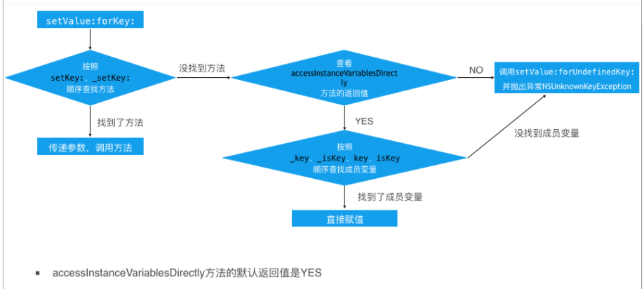
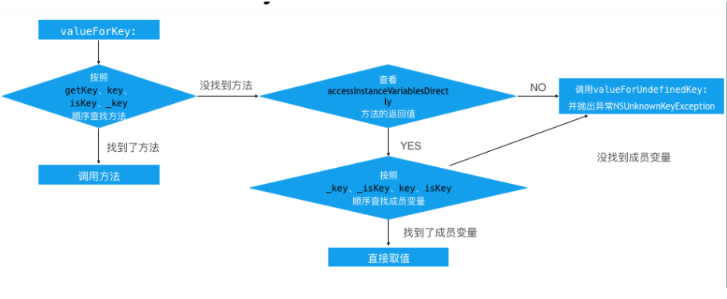

# KVC
> KVC是 key-value coding缩写  俗称 ‘键值编码’，通过一个key来访问某个属性，并改变相关属性值


####1、KVC常见的API介绍
```
- (void)setValue:(id)value forKeyPath:(NSString *)keyPath;
- (void)setValue:(id)value forKey:(NSString *)key;
- (id)valueForKeyPath:(NSString *)keyPath;
- (id)valueForKey:(NSString *)key; 
```

####2、通过KVC修改属性会触发KVO吗？
&nbsp;&nbsp;&nbsp;&nbsp;&nbsp;&nbsp;会触发KVO

####3、KVC设值原理


####4、KVC取值原理



####5、KVC的keyPath中的集合运算符的使用
1、简单集合操作符：返回string，number等
```
@count:返回一个值为集合中对象总数的NSNumber对象。
@sum:首先把集合中的每个对象都转换为double类型，然后计算其总，最后返回一个值为这个总和的NSNumber对象。
@avg:首先把集合中的每个对象都转换为double类型，然后计算其平均值，最后返回一个值为该平均值的NSNumber对象。
@max:使用compare:方法来确定最大值。所以为了让其正常工作，集合中所有的对象都必须支持和另一个对象的比较。
@min:和@max一样，但是返回的是集合中的最小值。

```
2、对象操作符
&nbsp;&nbsp;&nbsp;&nbsp;&nbsp;@unionOfObjects/@distincUnionOfObjects 返回一个由操作符右边的key path指定的对象属性组成的数组，distincUnionOfObjects会对数组去重。

3、对象操作符
&nbsp;&nbsp;&nbsp;&nbsp;&nbsp;@distinctUnionOfArrays/@unionOfArrays 返回一个数组，其中包含这个这个数组中每个子数组对于这个操作符号右边指定的key path进行操作之后的值。

###面试题：
1、KVC和KVO的keyPath一定是属性么？

&nbsp;&nbsp;&nbsp;&nbsp;KVC 支持实例变量，KVO 只能手动支[手动设定实例变量的KVO实现监听


