#### 一、block的本质是什么：
* block本质上也是一个OC对象，它内部也有个isa指针
* block是封装了 函数调用 以及 函数调用环境 的OC对象
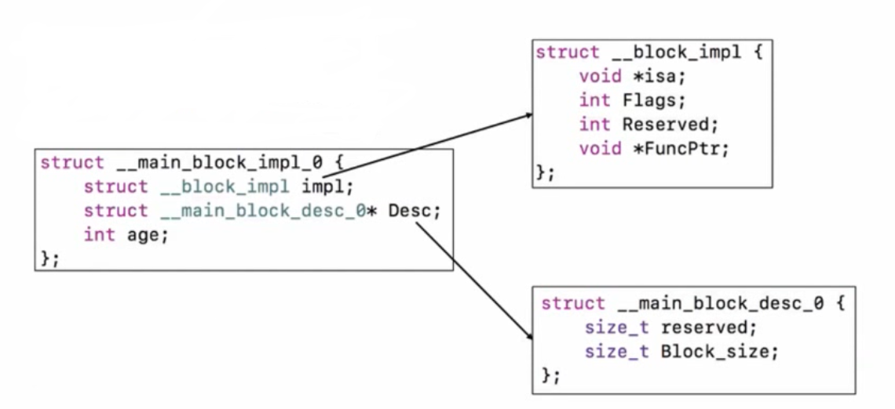


#### 二、block的变量捕获：
* 2.1 、为了保证block内部能够正常访问外部变量，block有个变量捕获机制!

* 2.2 、局部变量的访问
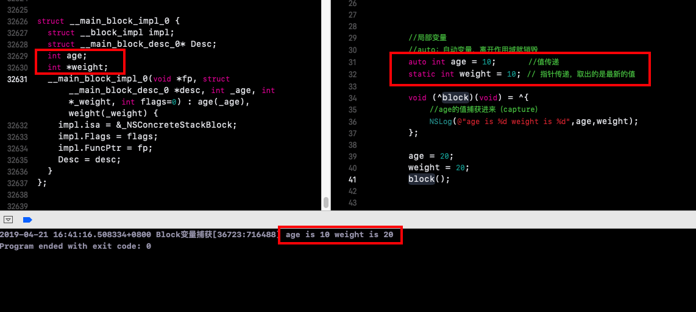
局部静态变量，传递的是一个指针！通过指针地址来获取值

* 2.3 、全局部变量的访问
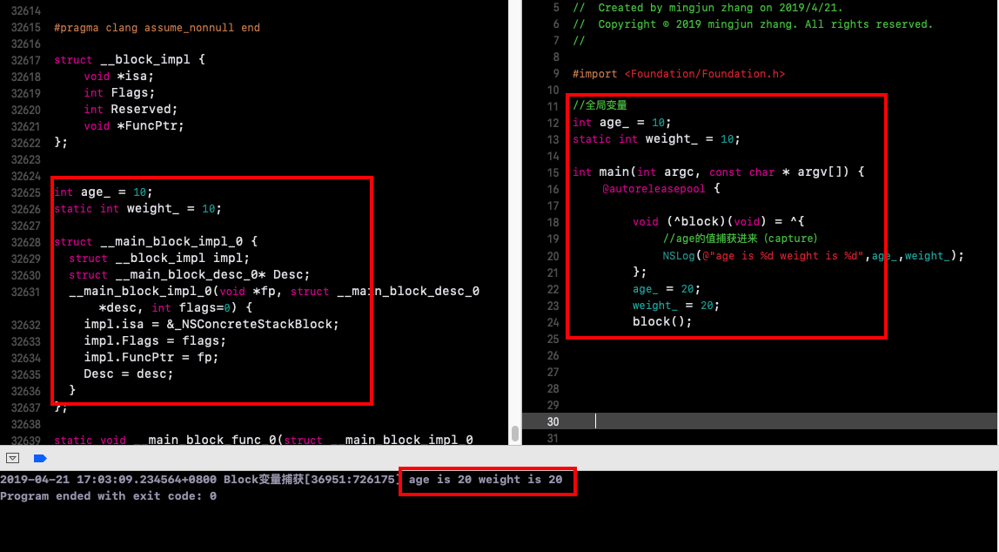

* 2.4、 self的的问题
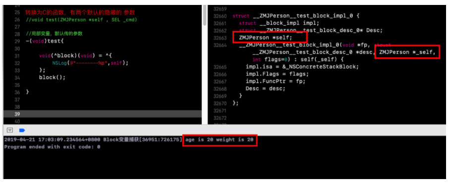
* 提示：self是我们调用函数的时候，传进来的参数，self是局部变量，只要能捕获就是局部变量，反之，全局变量无法捕获。

#### 三、block的类型：

3.1、block有3种类型：
&nbsp;&nbsp;&nbsp;&nbsp;&nbsp;&nbsp;&nbsp;&nbsp;&nbsp;&nbsp;可以通过调用class方法或者isa指针查看具体类型，最终都是继承自NSBlock类型
* __NSGlobalBlock__
*  __NSStackBlock__
* __NSMallocBlock__
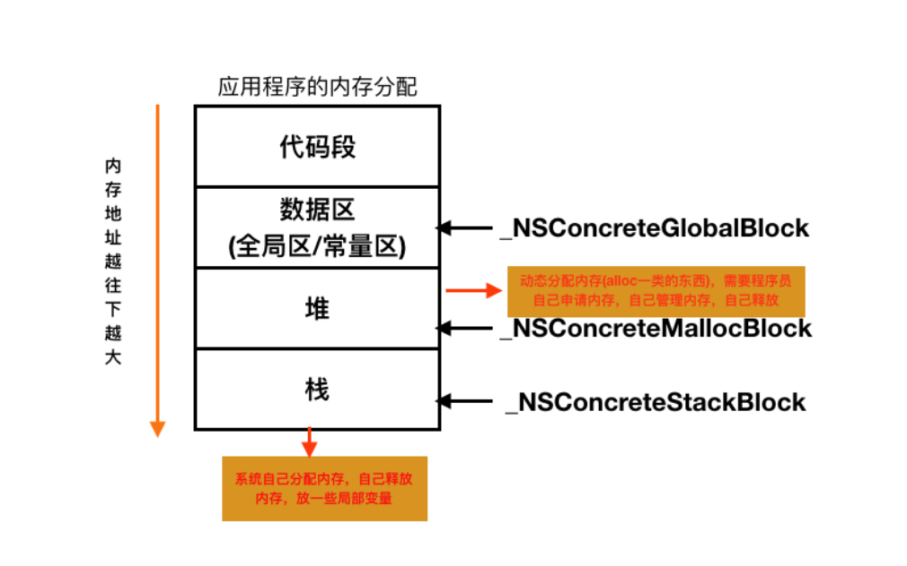
* 提示：类对象也是存放在堆里面

3.2、block在MRC下的类型：
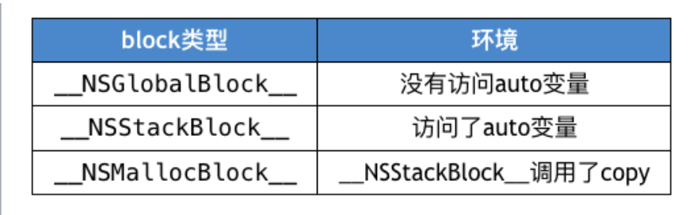

* 关掉ARC
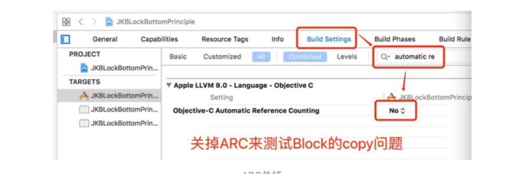
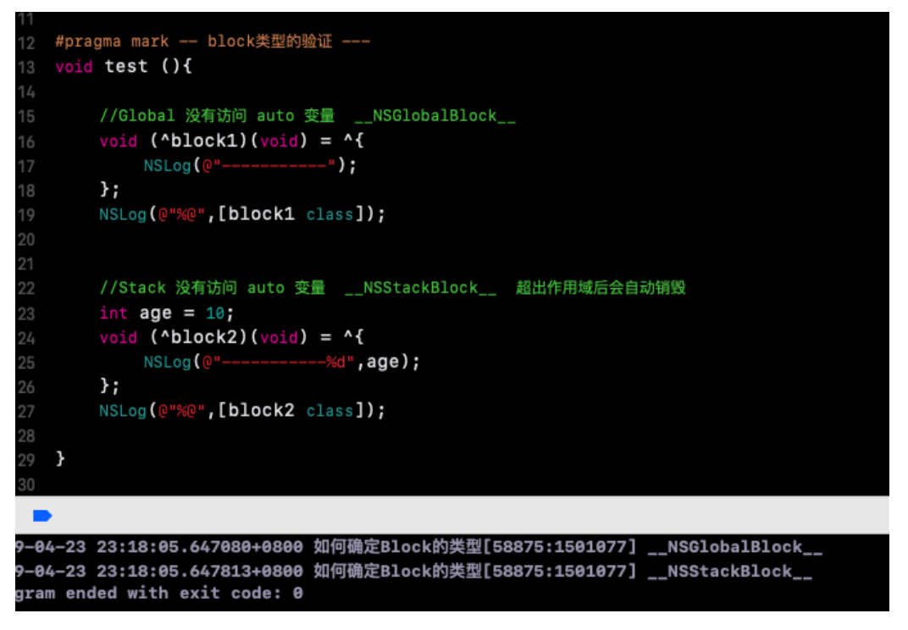

3.3、block各种类型调用copy结果：
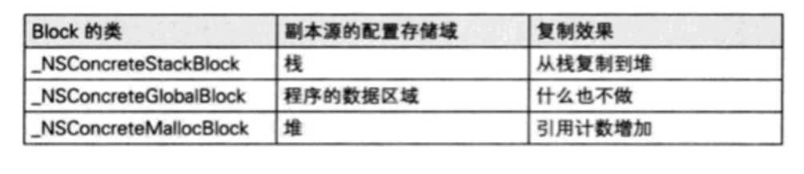
放在栈区的变量，当出了函数作用域后就会自动销毁；得到的值是一个确定的，只有使用copy操作后，才能将栈区的变量放到堆区，不会释放，得到正确的值
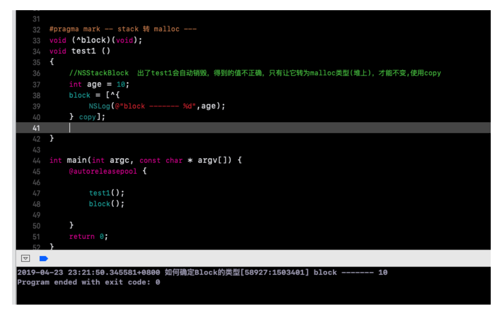

#### 四、Block的Copy操作：
1、在ARC环境下，编译器会根据情况自动将栈上的block复制到堆上，比如以下情况
  *  block作为函数返回值时
  *  将block赋值给__strong指针时
  *  block作为Cocoa API中方法名含有usingBlock的方法参数时
  *  block作为GCD API的方法参数时（GCD的Block都是被copy过的，会在block方法执行完后才会销毁）

2、MRC下block属性的建议写法
  *  @property (copy, nonatomic) void (^block)(void);

3、ARC下block属性的建议写法
* @property (strong, nonatomic) void (^block)(void);
* @property (copy, nonatomic) void (^block)(void);

#### 五、对象类型的auto变量
当block内部访问了对象类型的auto变量时，发生了什么？？
1、如果block是在栈上，将不会对auto变量产生强引用
2、如果block被拷贝到堆上：
```
1、会调用block内部的copy函数
2、copy函数内部会调用_Block_object_assign函数
3、_Block_object_assign函数会根据auto变量的修饰符(__strong、__weak、__unsafe_unretained)
做出相应的操作，类似于retain(形成强引用、弱引用)
```
3、如果block从堆上移除：
```
1、会调用block内部的dispose函数
2、dispose函数内部会调用_Block_object_dispose函数
3、_Block_object_dispose函数会自动释放引用的auto变量（release）
```
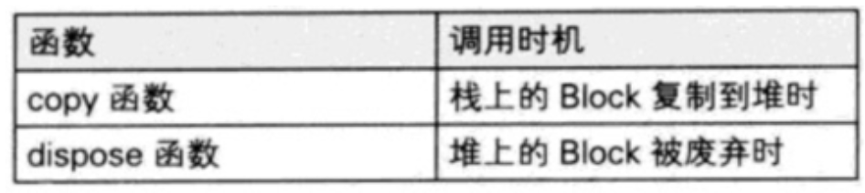


#### 六、__block修饰符
1、__block修饰变量
  *  __block可以用于解决block内部无法修改auto变量值的问题
  *  __block不能修饰全局变量、静态变量（static）

2、__block本质

* 编译器会将__block变量包装成一个对象


3、__block的内存管理

* 3.1、当block在栈上时，并不会对__block变量产生强引用
* 3.2、当block被copy到堆时
```
  会调用block内部的copy函数
  copy函数内部会调用_Block_object_assign函数
  _Block_object_assign函数会对__block变量形成强引用（retain）`
```
* 3.3、当block从堆中移除时
```
  会调用block内部的dispose函数
  dispose函数内部会调用_Block_object_dispose函数
  _Block_object_dispose函数会自动释放引用的__block变量（release）
```

* 3.4、__block的__forwarding指针

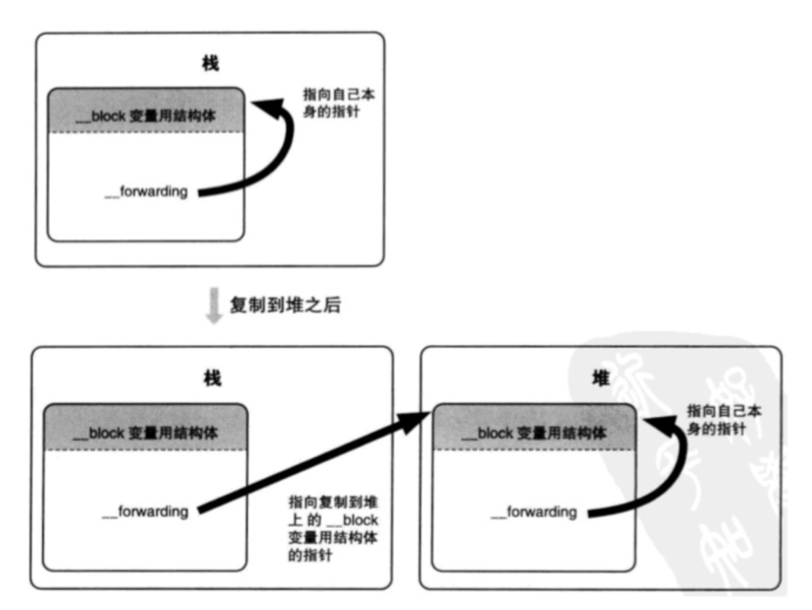

* 3.5、对象类型的auto变量、__block变量
    * 当block在栈上时，对它们都不会产生强引用
    * 当block拷贝到堆上时，都会通过copy函数来处理它们
      *  __block变量（假设变量名叫做a）
      ```
        _Block_object_assign((void*)&dst->a, (void*)src->a, 8/*BLOCK_FIELD_IS_BYREF*/);
      ```
      *  对象类型的auto变量（假设变量名叫做p）
      ```
        _Block_object_assign((void*)&dst->p, (void*)src->p, 3/*BLOCK_FIELD_IS_OBJECT*/);
      ```

    * 当block从堆上移除时，都会通过dispose函数来释放它们
      *  __block变量（假设变量名叫做a）
      ```
        _Block_object_dispose((void*)src->a, 8/*BLOCK_FIELD_IS_BYREF*/);
      ```
      *  对象类型的auto变量（假设变量名叫做p）
      ```
        _Block_object_dispose((void*)src->p, 3/*BLOCK_FIELD_IS_OBJECT*/);
      ```


* 3.6、被__block修饰的对象类型
  * 当__block变量在栈上时，不会对指向的对象产生强引用
  * 当__block变量被copy到堆时
  ```
      1、会调用__block变量内部的copy函数
      2、copy函数内部会调用_Block_object_assign函数
      3、_Block_object_assign函数会根据所指向对象的修饰符（__strong、__weak、__unsafe_unretained）做出相应的操作，形成强引用（retain）或者弱引用（注意：这里仅限于ARC时会retain，MRC时不会retain）
  ```
  * 如果__block变量从堆上移除
  ```
      1、会调用__block变量内部的dispose函数
      2、dispose函数内部会调用_Block_object_dispose函数
      3、_Block_object_dispose函数会自动释放指向的对象（release）
  ```


#### 七、面试题

1、block的原理是怎样的？本质是什么？

> 答：封装了函数调用以及调用环境的OC对象

2、__block的作用是什么？有什么使用注意点？

> 答： __block可以用于解决block内部无法修改auto变量值的问题，__block不能修饰全局变量、静态变量（static），编译器会将__block变量包装成一个对象，注意的地方是：__block的内存管理和在block所形成的结构体的OC对象在ARC时会retain(强引用)，MRC时不会retain(不会强引用)。

3、block的属性修饰词为什么是copy？使用block有哪些使用注意？
> 答：block一旦没有进行copy操作，就不会在堆上（在堆上可以对其进行内存管理）
使用注意：循环引用问题


