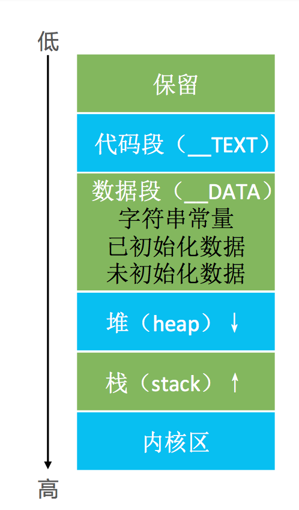
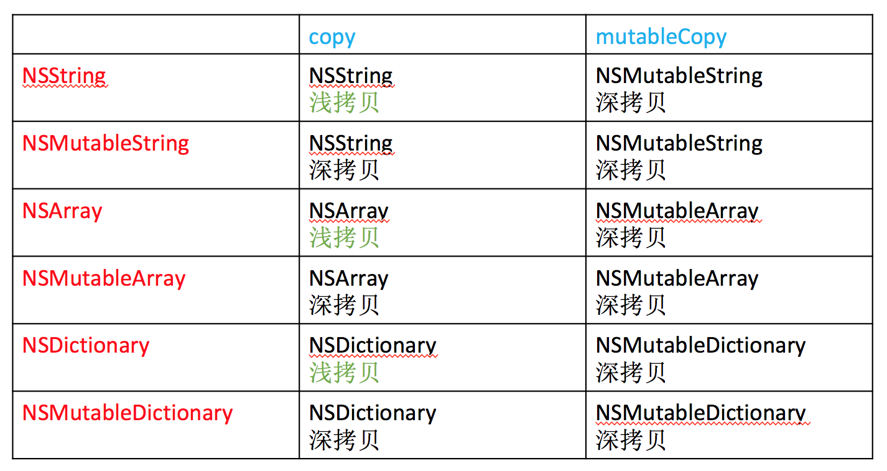
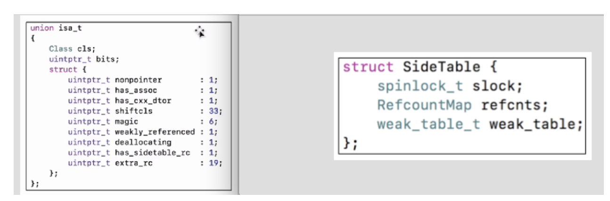
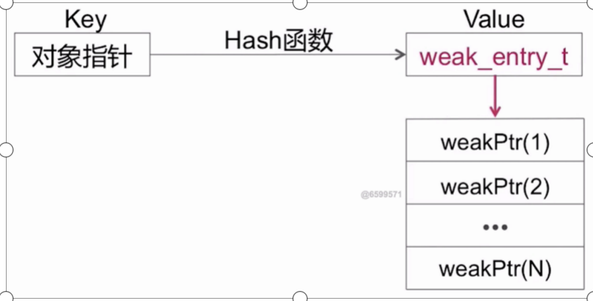
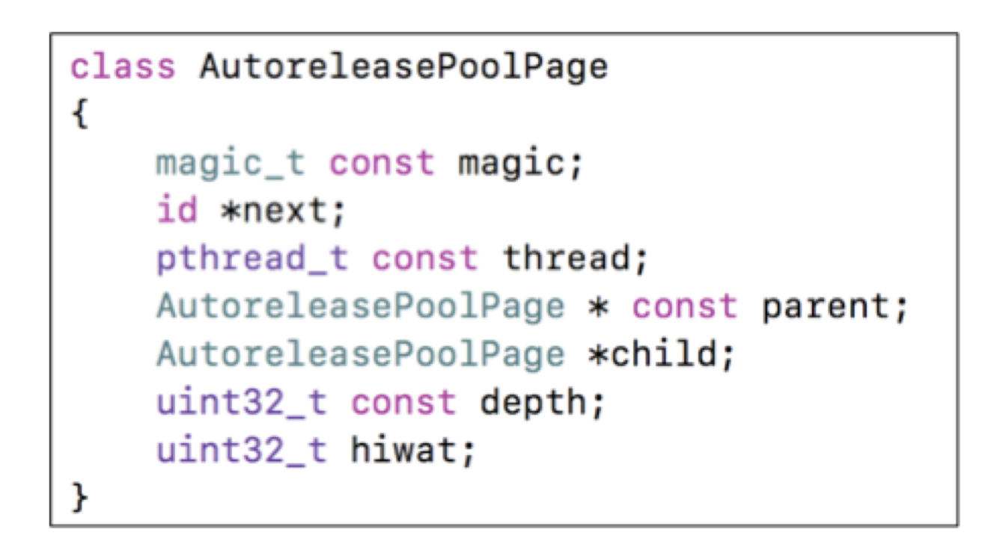
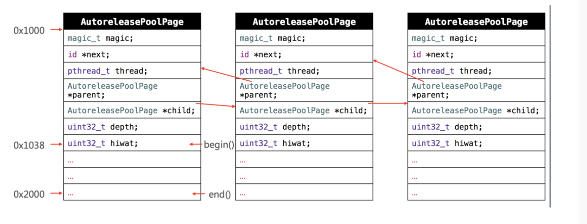

####一、定时器 （CADisplayLink、NSTimer）
1、它们会对target产生强引用，如果target又对他们产生强引用，那么就会发生循环引用
2、CADisplayLink、NSTimer都是基于runloop实现的
    *  NSTimer触发时间到的时候，runloop如果在阻塞状态，触发时间会推迟到下一个runloop周期
    *  CADisplayLink 根据屏幕的刷新频率一致，runloop如果在阻塞状态，触发时间会延迟
3、解决循环引用的方案：
    * 使用block方案 + __weak
    *  使用代理对象(NSProxy)


####二、定时器 （GCD）

比较准时，它直接和系统内核挂钩的(NSTimer依赖于RunLoop，如果RunLoop的任务过于繁重，可能会导致NSTimer不准时
```
  //创建队列
    //    dispatch_queue_t queue = dispatch_get_main_queue();
    dispatch_queue_t queue = dispatch_queue_create("timer", DISPATCH_QUEUE_SERIAL);
  
    /*
     创建定时器
     1、 intervalInSeconds 时间值 多少秒后开始执行
     2、 leewayInSeconds   时间间隔 多长时间开始执行
     */
    dispatch_source_t timer = dispatch_source_create(DISPATCH_SOURCE_TYPE_TIMER, 0, 0, queue);
    dispatch_source_set_timer(timer, DISPATCH_TIME_NOW, 2.0 * NSEC_PER_SEC, 1.0 * NSEC_PER_SEC);
    //第一种方法：
    //    dispatch_source_set_event_handler(timer, ^{
    //        NSLog(@"111111111");
    //    });
    
    //第二种方法：
    dispatch_source_set_event_handler_f(timer, timerFire);
    dispatch_resume(timer);
    
    self.timer = timer;
```

###三、 ios的内存布局
##### 1、内存布局.

1、保留的内存空间
2、栈（stack）：函数调用开销，比如局部变量。分配的内存空间地址越来越小
<br>
3、堆（heap）：通过alloc、malloc、calloc等动态分配的空间， 分配的内存空间地址越来越大
4、数据段：
```
字符串常量：比如NSString *str = @"456"
未初始化数据（bss）：未初始化的全局变量、静态变量等，比如：static int d;
已初始化数据（data）: 已初始化的全局变量、静态变量等,比如：static int c = 20;
```
5、代码段（text）：编译之后的代码
6、内核区

##### 2、内存管理方案
* 对于小对象TaggedPointer
* NONPOINTER_ISA(64位架构下)，占用64个比特位，只占用32-40比特位
```
 第一位的 0 或 1 代表是纯地址型 isa 指针，还是 NONPOINTER_ISA 指针。 
 第二位，代表是否有关联对象 
 第三位代表是否有 C++ 代码。 
 接下来 33 位表示对象的类对象的内存地址 
 接下来有 弱引用 的标记 
 接下来有是否 delloc 的标记
 当前isa指针当中所存储的引用计数已经达到上限的话，需要外挂一个SideTables 数据存储相	   关的引用计数内容
 后续的是额外的引用计数的存储
```
* 散列表：包含了弱引用表和引用技术表
```
 SideTables 表在 非嵌入式的 64 位系统中，有 64 张 SideTable 表 
 SideTable由三部分组成。自旋锁、引用计数表、弱引用表。 
 全局的引用计数 之所以不存在同一张表中，是为了避免资源竞争，解决效率的问题。 
 引用计数表中引入了分离锁的概念，将一张表分拆成多个部分，对他们分别加锁，可以实现并发操作，提升执行效率 
```

##### 3、Tagged Pointer
1、从64bit开始，iOS引入了Tagged Pointer技术，用于优化NSNumber、NSDate、NSString等小对象的存储

2、在没有使用Tagged Pointer之前， NSNumber等对象需要动态分配内存、维护引用计数等，NSNumber指针存储的是堆中NSNumber对象的地址值

3、使用Tagged Pointer之后，NSNumber指针里面存储的数据变成了：Tag + Data，也就是将数据直接存储在了指针中

4、当指针不够存储数据时，才会使用动态分配内存的方式来存储数据

5、objc_msgSend能识别Tagged Pointer，比如NSNumber的intValue方法，直接从指针提取数据，节省了以前的调用开销

6、那怎么判断一个指针是不是 Tagged Pointer 呢？可以通过 objc 源码看到对应的判断方法如下：
```
static inline bool 
_objc_isTaggedPointer(const void *ptr) 
{
   return ((intptr_t)ptr & _OBJC_TAG_MASK) == _OBJC_TAG_MASK;
}

#if OBJC_MSB_TAGGED_POINTERS
#   define _OBJC_TAG_MASK (1ULL<<63)
#else
#   define _OBJC_TAG_MASK 1
#endif

#if TARGET_OS_OSX && __x86_64__
// 64-bit Mac - tag bit is LSB
#   define OBJC_MSB_TAGGED_POINTERS 0
#else
// Everything else - tag bit is MSB
#   define OBJC_MSB_TAGGED_POINTERS 1
#endif
```
如何判断一个指针是否为Tagged Pointer？
iOS平台，最高有效位是1（第64bit）
Mac平台，最低有效位是1


###四、 OC对象的内存管理
##### 1、什么是ARC
* MRC：手动引用计数
```
    alloc、retain、release、retainCount、autorelease、dealloc
```	
* ARC：自动引用计数
```
    1、LLVM + Runtime 会为我们代码自动插入retain和release 以及atutorelease等代码，不需要我们手动管理
    2、禁止使用retain、release、retainCount、autorelease
    3、RC中新增weak、strong属性关键字
```

##### 2、对象的内存管理
* 在iOS中，使用引用计数来管理OC对象的内存
* 一个新创建的OC对象引用计数默认是1，当引用计数减为0，OC对象就会销毁，释放其占用的内存空间
* 调用retain会让OC对象的引用计数+1，调用release会让OC对象的引用计数-1

* 内存管理的经验总结
```
    1、当调用alloc、new、copy、mutableCopy方法返回了一个对象，在不需要这个对象时，要调用release或者autorelease来释放它
    2、想拥有某个对象，就让它的引用计数+1；不想再拥有某个对象，就让它的引用计数-1
```

* 可以通过以下私有函数来查看自动释放池的情况
    extern void _objc_autoreleasePoolPrint(void);

##### 3、浅拷贝(copy)与深拷贝(mutableCopy)

* 深拷贝：内容拷贝，产生新的对象
* 浅拷贝：指针拷贝，没有产生新的对象*

```
Foundation框架中
1、mutablecopy操作的都是深拷贝；copy操作的不可变都是浅拷贝，操作的可变都是深拷贝
2、浅拷贝：指针拷贝，没有产生新的对象
3、 自定义的类中，只有遵循NSCopying协议的类，才支持copy；只有遵循NSMutableCopying协议的类，才支持mutableCopy
```

##### 4、引用计数的存储
*  在64bit中，引用计数可以直接存储在优化过的isa指针中，也可能存储在SideTable类中

```
    1、extra_rc : 里面存储的值是引用计数器减1
    2、has_sidetable_rc: 引用计数器是否过大无法存储在isa中; 如果为1，那么引用计数器会存储在一个叫sideTable的类的属性中
    3、refcnts是一个存放着对象引用计数的散列表
```

* SideTable表的数据结构
```
1、自旋锁(Spinlock_t)：
    Spinlock_t：是一种 忙等 的锁；(适用于轻量访问)
    当前锁已被其他线程获取，当前线程会不断的探测 锁是否会被释放。如果释放则第一时间获取。
```
```
2、引用计数表(refcnts)：
    实际上是一个哈希表，提高查找效率。
    引用计数实际上是一个无符号long的变量，
    Size_t：每个byte位表示的含义：
        * 第一位表示是否有弱引用，0是没有，1是有；
        * 第二位表示对象dealloc
        * 后面是实际引用计数值
```
```
3、弱引用表(weak_table_t)：哈希表
```

```
通过Hash函数可以找到对应的弱引用的对象存储位置
```

##### 5、弱引用管理
1、系统如何将weak变量添加到它对应的弱引用表当中：
```
一个被声明为__weak的对象指针，经过编译器调用objc_initWeak()方法，
经过一系列的函数调用栈，在weak_register_no_lock中进行弱引用变量的添加，
添加位置通过hash算法进行位置查找，如果查找位置当中有已经有当前对象对应的弱引用数组，
则添加到数组中，没有则重新创建，添加为首元素
```

2、当一个对象释放之后，weak变量是如何处理的？
```
清除weak变量，同时设置指向为nil
当一个对象被dealloc后，在dealloc内部实现当中会调用弱引用清除的相关函数，
在函数当中会根据当前对象指针，查找弱引用表，
把当前对象相应的弱引用都拿出来是一个数组，遍历数组分别置位nil
```


###五、 autorelease自动释放池
1、自动释放池的主要底层数据结构是__AtAutoreleasePool、AutoreleasePoolPage
2、调用了autorelease的对象最终都是通过AutoreleasePoolPage对象来管理的
3、objc4源码：NSObject.mm

4、AutoreleasePoolPage的结构
    * 每个AutoreleasePoolPage对象占用4096字节内存，除了用来存放它内部的成员变量，剩下的空间用来存放autorelease对象的地址
    * 所有的AutoreleasePoolPage对象以栈为节点，通过双向链表的形式组合而成
   
    * 调用push方法会将一个POOL_BOUNDARY入栈，并且返回其存放的内存地址
    * 调用pop方法时传入一个POOL_BOUNDARY的内存地址，会从最后一个入栈的对象开始发送release消息，直到遇到这个POOL_BOUNDARY
    * id *next指向了下一个能存放autorelease对象地址的区域
    * 是和线程一一对应的
5、AutoreleasePool什么时候释放?
&nbsp;&nbsp;&nbsp;&nbsp;&nbsp;&nbsp; App启动后，苹果在主线程RunLoop里注册了两个Observer，回调都是_wrapRunLoopWithAutoreleasePoolHandler()。 
* 第一个Observer监视的事件是 Entry( 即将进入Loop时) ，其回调内会调用 _objc_autoreleasePoolPush() 创建一个自动释放池。其 order 是 -2147483647，优先级最高，保证创建释放池发生在其他所有回调之前。 
*  第二个Observer监视了两个事件 ：BeforeWaiting( 准备进入休眠)时调用 _objc_autoreleasePoolPop() 和 _objc_autoreleasePoolPush() 释放旧的池并创建新池；Exit(即将退出 Loop) 时调用 _objc_autoreleasePoolPop() 来释放自动释放池。这个 Observer 的 order是 2147483647，优先级最低，保证其释放池子发生在其他所有回调之后。 


6、AutoreleasePool与autorelease区别

AutoreleasePool：
* 自动释放池存储于内存中的栈中遵循”先进后出”原则
   * 当自动释放池销毁时自动释放池中所有对象作release操作 

Autorelease：
 *  对象执行autorelease方法时会将对象添加到自动释放池中 
* 对象执行autorelease方法后自身引用计数器不会改变，而且会返回对象本身
* autorelease实际上只是把对象release的调用延迟了，对于对象的autorelease系统只是把当前对象放入了当前对应的autorelease pool中，当该pool被释放时，该pool中的所有对象会被调用Release,从而释放使用的内存。这个可以说是autorelease的优点，因为无需我们再关注他的引用计数，直接交给系统来做！
* 对于操作占用内存比较大的对象的时候不要随便使用，担心对象释放的时间太迟，造成内存高峰， 但是操作占用内存比较小的对象可以使用


https://github.com/skyming/Trip-to-iOS-Design-Patterns
https://design-patterns.readthedocs.io/zh_CN/latest/


